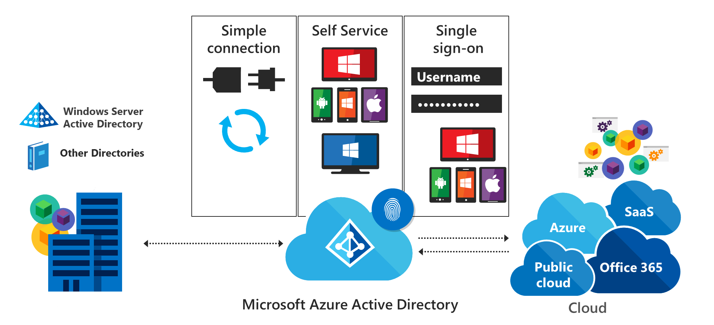

# Secure Azure solutions with Azure Active Directory:

## Active Directory:
- `Cloud-based identity and access management service to secure Azure services & resources.`
- `A database where user cred stored & used to auth users across assets to access services/resources`
- 
- Used by IT Admins, Devs, and CRM for SSO, Credentials, Secure Key, self-service password reset, and MFA, domain controller[^1].
- Paid licenses (Premium P1 and P2) enhance Azure AD with self-service options(Pwd reset), advanced administration, and security features.
- 
- 
- 

## Types of AD:
1. Azure Active Directory (Azure AD): Cloud-based identity and mobile device management
2. Active Directory Domain Services (AD DS): Enterprise-ready lightweight directory access protocol (LDAP)[^2] server that provides key features such as identity and authentication, computer object management, group policy, and trusts.
3. Azure Active Directory Domain Services (Azure AD DS): Combination of Azure AD + Domain Services.

## Azure AD DS and Azure AD:
- `On Azure AD-joined Devices: Authentication - modern OAuth / OpenID` Connect-based protocols for `mobile or desktop devices`.
- `With Azure AD DS-joined devices: Authentication - Kerberos and New Technology LAN Manager (NTLM)` protocols to support `legacy applications ` & On-prem Server VMs deployed in Azure.

## Investigate roles in Azure AD:
- Azure AD-specific roles: `User, Application and Groups Administrator`
- Service-specific roles: For non-Azure AD eg. ms 365, `Exchange ,Intune ,SharePoint, and Teams Administrator`
- Cross-service roles: `Global Administrator and Global Reader, Security Administrator and Security Reader` (Microsoft 365 Defender portal, Microsoft Defender Advanced Threat Protection)
- 
> Azure AD DS integrates with Azure AD, which can synchronize with an on-premises AD DS environment. This ability extends central identity use cases to traditional web applications that run in Azure as part of a lift-and-shift strategy.

## Create and manage Azure AD users:
- must be a User Administrator or Global Administrator.
- Azure Portal > AZure AD > Users > Create new user or Invite external user
- can also invite the new guest user to collaborate with your organization.
- Delete a user: Azure Active Directory > Users > Azure AD tenant > Delete user.
- Azure AD groups, you can grant access and permissions to a group of users instead of each individual user.

## Implement passwordless authentication:
-  Concept: something you have, plus something you are or something you know
-  Hello for Business, Microsoft Authenticator, Fast Identity Online2 (FIDO2).

[^1]: to manage trust among the domains by granting access to users from one domain to the other via a proper security authentication process.
[^2]: think of a directory as a database that stores information about users, groups, and resources within an organization. LDAP provides a way to search, retrieve, and modify this information in a structured manner.
[^3]: Both Kerberos and NTLM provide a way to verify the identity of users and grant access to resources based on their credentials. However, Kerberos is considered more secure and efficient, and it is the preferred authentication mechanism in modern IT environments.
[^4]: 
